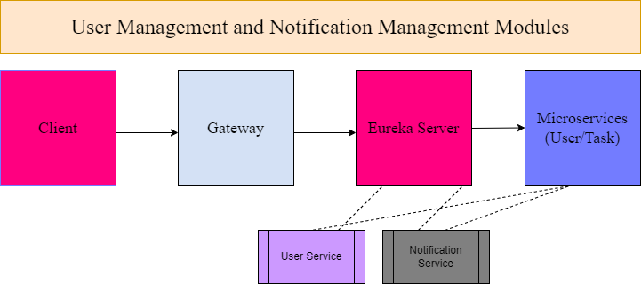
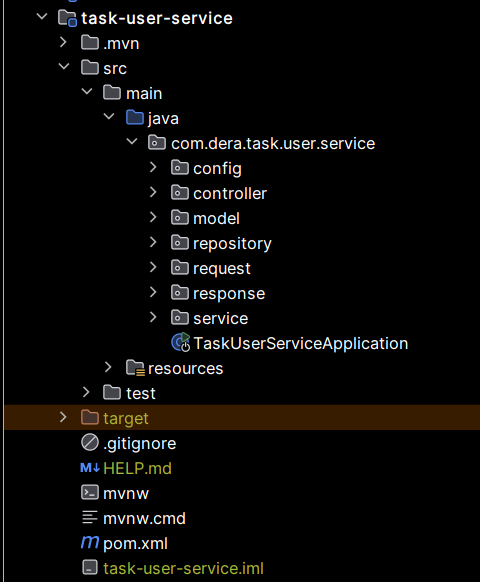
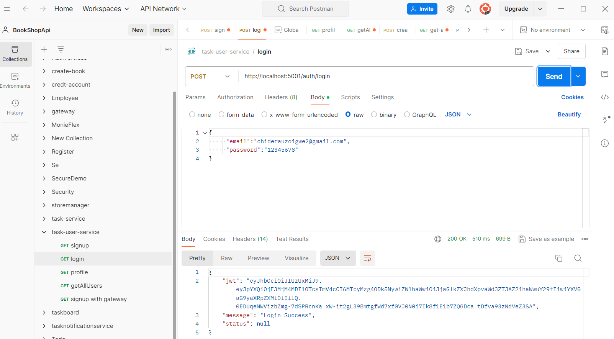
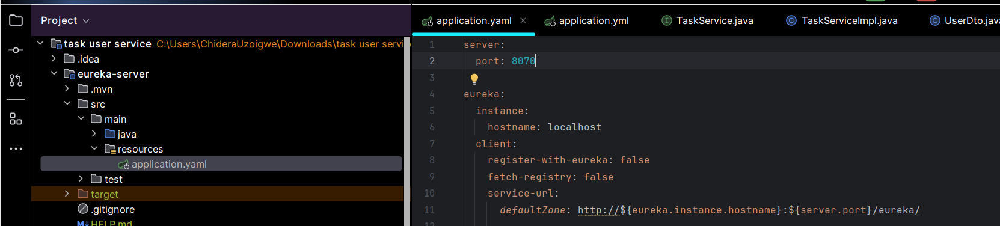
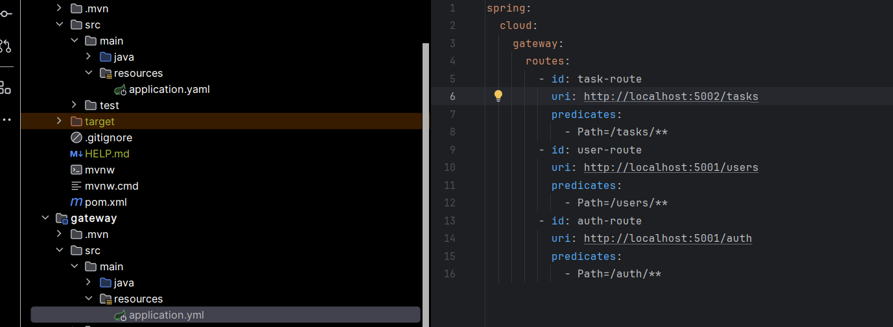

---

# User Management and Notification Management Modules


## User Management Service
### Overview
This is a user management module built with Java 17, Spring Boot, and Maven. The system includes a **User Service** for user management, a **Gateway** for routing, and an **Eureka Server** for service discovery. The project is organized using a **mono repo approach**, where all microservices, the registry, and the gateway are contained within a single repository and folder structure for Unified Version Control, Easier Refactoring, Shared Code and Libraries, and Consistent Development Environment. All services are documented and tested using Postman.


## Architecture
- **User Service**: Handles user authentication, profile management, and profile picture uploads.
- **Gateway**: Routes requests to the appropriate microservice.
- **Eureka Server**: Acts as the service registry for discovering services.

## Technologies Used
- **Java 17**: The programming language used to build the microservices.
- **Spring Boot**: Framework to simplify the creation of production-ready applications.
- **Spring Cloud Eureka Discovery**: Provides service registration and discovery functionality.
- **Spring Security**: Used for securing the application with JWT authentication.
- **Spring Data JPA**: Manages data access using the Java Persistence API.
- **MySQL**: The relational database used for data storage.
- **Lombok**: Reduces boilerplate code by generating common methods like getters and setters.
- **Maven**: Build automation tool used to manage dependencies and project build lifecycle.
- **IntelliJ IDEA**: Integrated Development Environment (IDE) used for coding, debugging, and running the services.
- **Postman**: Tool used for testing and documenting the API endpoints.

## Services Overview

### 1. User Service

- **Port**: `5001`
- **Dependencies**:
    - **Spring Security**: Secures the application with JWT authentication.
    - **Lombok**: Reduces boilerplate code by generating getters, setters, and other common methods.
    - **Eureka Client**: Registers the service with the Eureka Server for discovery.
    - **Spring Web**: Provides necessary functionality to build RESTful web services.
    - **Spring Boot DevTools**: Provides automatic restarts and live reload features for development.
    - **Spring Boot Starter Data JPA**: Simplifies data access using Java Persistence API (JPA).
    - **MySQL Driver**: Enables communication between the application and the MySQL database.
      

- **Entities**:
    - **User**: Represents a user in the system.

- **Controllers**:
    - **AuthController**: Manages user signup and login with JWT authentication.
    - **UserController**: Provides endpoints to retrieve user profiles and a list of all users.
      

- **Endpoints**:
    - `POST /auth/signup`: Signup a new user.
    - `POST /auth/login`: Login a user and obtain a JWT.
    - `GET /user/profile`: Retrieve the profile of the logged-in user.
    - `GET /user/all`: Retrieve a list of all users.
    - `PATCH /user/{userId}`: Update a user's profile (full name, email, and password).
    - `DELETE /user/{userId}`: Delete a user by ID.
    - `POST /user/profile-picture`: Upload a profile picture for a user.



- **Configuration**:
    - Configured to run on a custom server port `5001` using `application.yml`.

### 2. Eureka Server
- **Port**: `8070`
- **Dependencies**:
    - **Eureka Server Spring Cloud Discovery**: Manages service registration and discovery.
    - **Spring Boot Actuator**: Provides production-ready monitoring and management capabilities.
      

- **Configuration**:
    - The Eureka Server is configured to run on port `8070` and allows all services to register and discover each other.
      

### 3. Gateway
- **Port**: `8080`
- **Dependencies**:
    - **Spring Cloud Gateway**: Provides a simple, yet effective way to route API requests to the appropriate services.
      .png)

- **Configuration**:
    - Declarative Configuration was used for Gateway configuration.
    - Configured with routes for `UserController` and `AuthController`.
    - Routes are defined with an ID, URI, and predicate for each controller.
      

## Communication
- **Gateway**: All external API requests are routed through the Gateway, which directs them to the appropriate microservice.

## Getting Started
### Prerequisites
- Java 17
- Maven
- MySQL
- IntelliJ IDEA

### Cloning the Repository

Before running the services, you need to clone the repository from Git. Follow these steps:

1. Open your terminal or command prompt.

2. Navigate to the directory where you want to clone the project.

3. Run the following command to clone the repository:

   ```bash
   git clone https://github.com/Deraclassic/TaskBoardMicroservicesApp
   ```

4. Navigate into the cloned repository:

   ```bash
   cd TaskManagementMicroServiesApp
   ```

### Running the Services
1. **Eureka Server**:
    - Navigate to the `eureka-server` directory.
    - Run the server using `mvn spring-boot:run`.

2. **User Service**:
    - Navigate to the `user-service` directory.
    - Run the service using `mvn spring-boot:run`.

3. **Gateway**:
    - Navigate to the `gateway` directory.
    - Run the gateway using `mvn spring-boot:run`.

### Testing
- All endpoints are documented and can be tested using Postman. Ensure that the Eureka Server and all services are running before executing API requests.

## License
This project is licensed under the MIT License - see the [LICENSE](LICENSE) file for details.

## Contact
- For any inquiries, contact Chidera Uzoigwe at chiderauzoigwe2@gmail.com.

## Author
Chidera Cynthia Uzoigwe.

---

